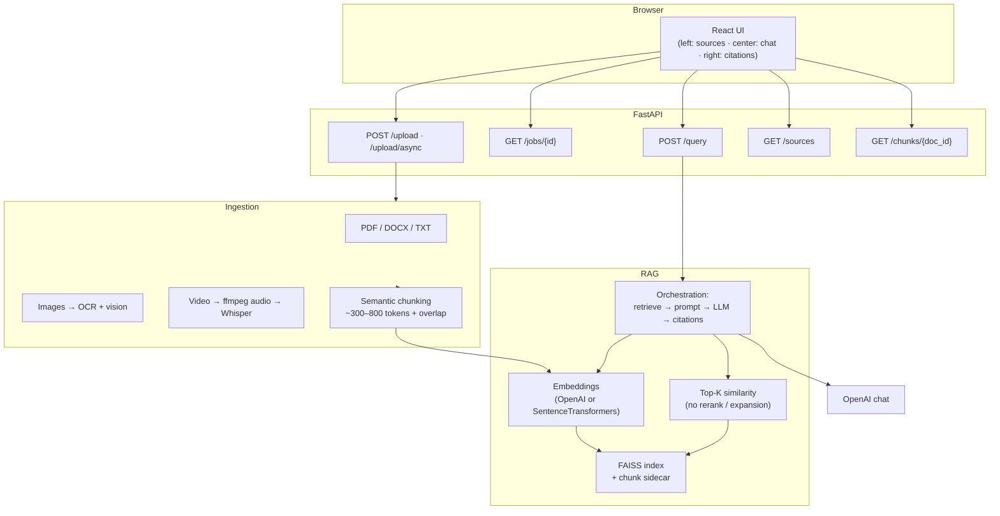

# Multimodal RAG (NotebookLM-style)

End-to-end **multimodal retrieval-augmented generation**: upload PDFs, DOCX, text, images (OCR + optional vision), and video (Whisper transcript + optional frame caption), then ask questions with **mandatory citations** and retrieved excerpt traceability.

Inspired by [Google NotebookLM](https://notebooklm.google/) — local-first, API-driven stack for research and demos.

---

## Architecture



**Separation of concerns**

| Layer | Responsibility |
|--------|----------------|
| `routers/` | HTTP, validation, status codes |
| `ingestion/` | Modality-specific extractors, chunking |
| `retrieval/` | FAISS persistence, top-K + scores |
| `orchestration/` | Prompt assembly, LLM call, citation packaging |
| `services/` | Embedding and LLM factories |

---

## Tech stack (mandatory)

- **Backend:** FastAPI, LangChain
- **Vector store:** FAISS (`faiss-cpu`)
- **LLM:** OpenAI, [Hugging Face Inference](https://huggingface.co/docs/inference-providers/index), or **free local [Ollama](https://ollama.com/)** (no API keys; `LLM_BACKEND=ollama` or `auto` with no paid keys)
- **Embeddings:** OpenAI, or Sentence Transformers (`USE_SENTENCE_TRANSFORMERS=true`) when not using OpenAI embeddings
- **Frontend:** React + Vite + TypeScript

---

## Prerequisites

- Python 3.11+
- Node 18+
- **LLM for `POST /query`:**  
  - **Free:** install **Ollama**, run `ollama pull llama3.2` (or set `OLLAMA_MODEL`), start the Ollama app — with `LLM_BACKEND=auto` and no OpenAI/HF env vars, the app uses Ollama on `http://127.0.0.1:11434`.  
  - **Paid/cloud:** `OPENAI_API_KEY` and/or Hugging Face token — see `.env.example`.
- **OpenAI** still needed if you use Whisper transcription, vision image captions, or OpenAI embeddings (unless you use Sentence Transformers + HF-only LLM)
- **ffmpeg** on `PATH` for video audio extraction ([ffmpeg.org](https://ffmpeg.org/))
- **Images:** Without OpenAI, use **Ollama vision** — run `ollama pull llava` (see `OLLAMA_VISION_MODEL` in `.env`). Optional: **Tesseract** for OCR-only (`brew install tesseract` on macOS).

---

## Run locally

### 1. Backend

```bash
cd backend
python -m venv .venv
source .venv/bin/activate   # Windows: .venv\Scripts\activate
pip install -r requirements.txt
# Free local LLM (Ollama): install https://ollama.com , then:
#   ollama pull llama3.2
# Config is already in backend/.env (or copy backend/ollama.env → backend/.env).
./run_dev.sh
# Or manually: source .venv/bin/activate && uvicorn app.main:app --reload --host 127.0.0.1 --port 8000
```

Data is written under `data/` at the **repository root** (uploads, FAISS index, `registry.json`).

### 2. Frontend

```bash
cd frontend
npm install
npm run dev
```

Open `http://localhost:5173`. The Vite dev server proxies API calls to `http://127.0.0.1:8000`.

---

## API

**Headers (all routes except `GET /health`):**

| Header | Required | Purpose |
|--------|----------|---------|
| `X-Tenant-ID` | Optional (default `default`) | **Workspace isolation** — data lives under `data/tenants/{id}/` (registry, uploads, FAISS, jobs). |
| `X-API-Key` or `Authorization: Bearer …` | Only if `API_KEY` is set in backend `.env` | Shared secret for demos / staging. |

**Legacy layout:** If you already have `data/registry.json` at the repo root and no `data/tenants/default/registry.json`, the **`default`** tenant continues to use the old `data/` paths so nothing breaks.

| Method | Path | Description |
|--------|------|-------------|
| `POST` | `/upload` | Multipart `files` — synchronous indexing; list of results |
| `POST` | `/upload/async` | **202** — same `files`, returns `[{ job_id, source_name }]`, processing in a background thread |
| `GET` | `/jobs/{job_id}` | Ingestion job status: `pending` → `running` → `completed` \| `failed` (+ `result` or `error`) |
| `POST` | `/query` | JSON body: `query`, optional `top_k`, `document_ids`, `response_format` |
| `GET` | `/sources` | List uploaded documents |
| `DELETE` | `/sources/{document_id}` | Remove source file, registry row, and FAISS chunks (use before re-uploading a bad image index) |
| `GET` | `/chunks/{doc_id}` | All chunks for traceability |
| `GET` | `/health` | Liveness (no auth, no tenant header required) |

The **default UI** uses `/upload/async` and polls `/jobs/{id}` so large PDFs or long video transcription do not block the browser. The **Workspace** field sets `X-Tenant-ID` (stored in `localStorage`).

**Note:** Concurrent background jobs share one FAISS index **per tenant**; for heavy parallel ingestion across many files, use a single-worker queue (e.g. Redis + worker) to avoid rare contention.

### Example: query

```bash
curl -s http://127.0.0.1:8000/query \
  -H "Content-Type: application/json" \
  -H "X-Tenant-ID: default" \
  -d '{"query":"Summarize the main risks mentioned.","top_k":5,"response_format":"bullets"}' | jq .
```

With `API_KEY` set:

```bash
curl -s http://127.0.0.1:8000/query \
  -H "Content-Type: application/json" \
  -H "X-API-Key: YOUR_KEY" \
  -H "X-Tenant-ID: default" \
  -d '{"query":"Hello"}' | jq .
```

Frontend: copy `frontend/.env.example` to `frontend/.env` and set `VITE_API_KEY` to match backend `API_KEY` when using enforced auth.

**Response shape:** `answer`, `citations[]` (each with `source_name`, `chunk_id`, `similarity_score`, full `excerpt`), and `retrieved_chunks_preview`.

---

## Example prompts

| Goal | Prompt | Optional `response_format` |
|------|--------|----------------------------|
| Q&A | “What deadline does the contract specify for delivery?” | default |
| Doc summary | “Give a one-page style summary of the uploaded PDF.” | `sections` |
| Multi-doc | “Compare pricing across the uploaded sources.” | `table` |
| Image / chart | “What does the chart show? List axes and trends.” | `bullets` |
| Video | “Summarize insights from the video transcript.” | `bullets` |

---

## Project layout

```
backend/app/
  deps.py        optional API key + X-Tenant-ID
  tenant_paths.py per-workspace directories
  routers/       upload, query, sources, chunks, jobs
  services/      embeddings, LLM, upload wiring, ingestion jobs
  ingestion/     pdf, docx, txt, image, video, chunking
  retrieval/     FAISS manager
  orchestration/ pipeline
  models/        Pydantic schemas
frontend/src/
  components/    layout, chat, sources, references, upload
  pages/         main notebook page
  services/      API client
  hooks/         useChat, useSources
```

---

## Production notes

- Run behind HTTPS, restrict CORS to real origins, and cap upload size / rate limits.
- **Do not mix embedding models** on the same FAISS index; clear the tenant’s `data/tenants/{id}/faiss` (or legacy `data/faiss` for default) when changing embedding settings.
- For strict air-gapped OCR, add a dedicated OCR service or bundle Tesseract; vision and Whisper require network access to OpenAI unless you swap implementations.

---

## License

MIT (project template — adjust as needed).
